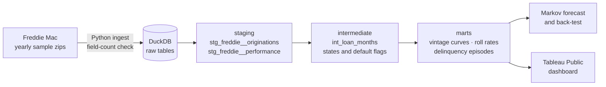

# Loan Portfolio Credit Risk Analytics

[](https://github.com/rajib-k-das/loan-credit-risk-analytics/actions/workflows/ci.yml)

A dbt + DuckDB warehouse that tracks about 200,000 US mortgages month by month, from origination to payoff or default,
and answers the questions a consumer-lending risk team asks every month:

- **How is each vintage performing** compared with earlier ones at the same age?
- **Where are loans rolling:** what share of 30-day-late loans cure, and what share roll to 60, 90 and default?
- **How long do delinquency episodes last,** and how many loans fall behind more than once?
- **What will defaults look like over the next 12 months,** and how accurate was that forecast in the past?

The data is real loan-level performance from the Freddie Mac Single-Family Loan-Level Dataset. The methods
(vintage curves, roll rates, transition-matrix forecasting) are the same ones used for auto loans, cards and personal loans.

## What it produces

| Layer | Output | Status |
|---|---|---|
| Ingestion | Freddie Mac yearly samples (2006, 2007, 2012, 2019), layout checked before loading | ✅ Done |
| Staging | Typed loans and loan-months; "not available" codes nulled; delinquency mapped explicitly | ✅ Done |
| Intermediate | Loan-month states: reported bucket (for roll rates) and absorbing credit state (for default) | ✅ Done |
| Intermediate | Default flags with and without COVID forbearance | ✅ Done |
| Marts | Vintage default curves by months on book | 🔜 Next |
| Marts | Roll-rate matrices | 🔜 Next |
| Marts | Delinquency episodes (gaps and islands) | 🔜 Next |
| Analysis | 12-month Markov forecast with back-test | 🔜 Planned |
| BI | Tableau Public dashboard | 🔜 Planned |

## Architecture



## Modeling choices

Every choice is logged with its alternatives in [`docs/decisions.md`](docs/decisions.md). The main ones:

- **Default** is the first month a loan is 90+ days past due, or a loss-type exit (short sale, third-party sale, REO).
- **Two state columns.** Roll rates need a bucket that can cure (90 → 60 → Current); default rates need a state that,
  once reached, stays. One column can't do both.
- **Forbearance is flagged, not hidden.** In 2020 forborne loans were reported as delinquent. Every default measure
  exists in two versions, with and without delinquency during forbearance.
- **Removals are censored.** Loans repurchased or sold out of the sample are neither defaults nor good loans.
- **Unknown stays unknown.** A missing status is never assumed to be current.

## Testing

dbt tests run on every push (GitHub Actions) against four synthetic loans with hand-checked answers:
a prepayment, a default that rolls 30 → 60 → 90 → 120 → REO, a COVID forbearance case
(a default in the raw view, not once forbearance is excluded), and a loan with an unknown month that is later removed.
Changing the default rule from 90 to 60 days makes the known-answer test fail, as it should.

Other tests check one row per loan per month, no activity after a loan exits, and that defaults never precede the first payment.

## How to run it

Requires Python 3.11+.

```bash
python3 -m venv .venv && source .venv/bin/activate
pip install -r requirements.txt

# Download the yearly sample zips from Freddie Mac (free registration) and put them in data/raw/
python ingest/load_freddie_mac.py
dbt build
python scripts/profile_data.py     # check codes and default rates against the assumptions
```

To run without the Freddie Mac data, load the synthetic test loans instead:

```bash
python ingest/load_freddie_mac.py --raw-dir tests/fixtures
dbt build
```

## Data source and terms

[Freddie Mac Single-Family Loan-Level Dataset](https://www.freddiemac.com/research/datasets/sf-loanlevel-dataset).
The data is free for non-commercial use with registration and may not be redistributed, so **no Freddie Mac data is
included in this repository**; it is git-ignored. Anyone can reproduce the results by downloading the same samples.

## Tech stack

Python (DuckDB, pandas) · dbt Core · SQL · GitHub Actions (CI) · Tableau Public
