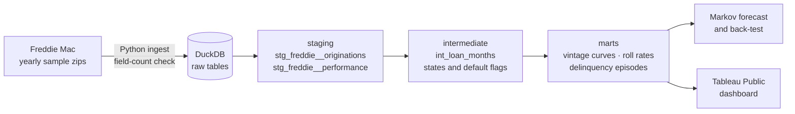

# Loan Portfolio Credit Risk Analytics

[](https://github.com/rajib-k-das/loan-credit-risk-analytics/actions/workflows/ci.yml)

A dbt + DuckDB warehouse that tracks about 200,000 US mortgages month by month, from origination to payoff or default,
and answers the questions a consumer-lending risk team asks every month:

- **How is each vintage performing** compared with earlier ones at the same age?
- **Where are loans rolling:** what share of 30-day-late loans cure, and what share roll to 60, 90 and default?
- **How long do delinquency episodes last,** and how many loans fall behind more than once?
- **What will defaults look like over the next 12 months,** and how accurate was that forecast in the past?

The data is real loan-level performance from the Freddie Mac Single-Family Loan-Level Dataset. The methods
(vintage curves, roll rates, transition-matrix forecasting) are the same ones used for auto loans, cards and personal loans.

## What it produces

| Layer | Output | Status |
|---|---|---|
| Ingestion | Freddie Mac yearly samples (2006, 2007, 2012, 2019), layout checked before loading | ✅ Done |
| Staging | Typed loans and loan-months; "not available" codes nulled; delinquency mapped explicitly | ✅ Done |
| Intermediate | Loan-month states: reported bucket (for roll rates) and absorbing credit state (for default) | ✅ Done |
| Intermediate | Default flags with and without COVID forbearance | ✅ Done |
| Marts | `dim_loan`: one row per loan with risk bands (credit score, LTV, DTI) and outcome | ✅ Done |
| Marts | `fct_vintage_curves`: cumulative default and prepayment rates by vintage, band and month on book | ✅ Done |
| Marts | `fct_roll_rates`: month-to-month transitions between delinquency buckets | ✅ Done |
| Marts | `fct_delinquency_episodes`: runs of delinquency (gaps and islands), with depth and outcome | ✅ Done |
| Marts | `fct_credit_state_transitions`: monthly moves between credit states, for the forecast | ✅ Done |
| Analysis | 12-month Markov forecast, back-tested every year 2007–2024 (`scripts/markov_forecast.py`) | ✅ Done |
| BI | Tableau Public dashboard | 🔜 Planned |

## Architecture



## What the data showed

Freddie Mac yearly samples: 200,000 loans, 12.6 million loan-months, reported to March 2026.

- **Vintage matters more than anything else.** By month 60, **13.4%** of 2007 loans had defaulted (90+ days late or a loss),
  against **1.35%** of 2012 loans: a tenfold gap between loans made at the peak of the bubble and loans made after it.
- **Credit score separates risk within a vintage.** In 2007, borrowers below 620 defaulted at **24.9%** by month 36;
  borrowers at 760+ at **2.3%**.
- **COVID forbearance distorts the standard default measure.** The 2019 vintage shows **4.91%** defaulted by month 36,
  but only **0.96%** once delinquency during forbearance is excluded. 44% of forbearance delinquency episodes reached
  90 days, yet **88% cured**, the same cure rate as ordinary episodes (87%). In forbearance, 90 days late did not
  mean what it normally means.
- **Roll rates rise with depth.** Outside forbearance, each month 0.9% of current loans miss a payment, 19% of 30-day
  loans roll to 60, 37% of 60-day loans roll to 90, and 59% of 90-day loans roll to 120+. Once past 120 days,
  91% are still there the next month.
- **The deeper the delinquency, the lower the cure rate.** Episodes that peaked at 30 days cured 97% of the time;
  episodes that reached 120+ cured 55% of the time, and 36% ended in foreclosure (REO) or a loss sale.
- **Delinquency repeats.** 47% of loans that ever fell behind did so more than once; 16% did so five or more times.
- **The forecast works in calm years and fails at turning points**, which is the useful lesson. Across 18 yearly
  back-tests (2007–2024) the median error in 12-month defaults was 25%:
  - **Calm years** were mostly within ±25% (2018: +8%, 2024: +5%).
  - **Turning points were missed.** December 2007 and 2008 forecasts under-predicted defaults by 47% and 44%: last
    year's roll rates could not see the crisis accelerating. December 2019 under-predicted by 90% (261 forecast vs
    2,689 actual): no history contained COVID.
  - **After a shock, it over-reacts.** December 2020 over-predicted by 306%: the 2020 matrix was full of forbearance
    delinquency (60 → default at 68% a month, against about 30% normally) that mostly cured.
  - **Portfolio mix matters.** December 2012 over-predicted by 72% as the new 2012 vintage joined: a single pooled
    matrix applied crisis-era roll rates to new, well-underwritten loans.

  A transition matrix is a sound baseline in stable conditions and blind at turning points, which is why loss
  forecasting under CECL and IFRS 9 adds macroeconomic scenarios on top.
- **Two inconsistent loans** (out of 200,000) report 90+ days late before their first payment was due. They are flagged
  and excluded from curves and forecasts ([decision 009](docs/decisions.md)).

## Modeling choices

Every choice is logged with its alternatives in [`docs/decisions.md`](docs/decisions.md). The main ones:

- **Default** is the first month a loan is 90+ days past due, or a loss-type exit (short sale, third-party sale, REO).
- **Two state columns.** Roll rates need a bucket that can cure (90 → 60 → Current); default rates need a state that,
  once reached, stays. One column can't do both.
- **Forbearance is flagged, not hidden.** In 2020 forborne loans were reported as delinquent. Every default measure
  exists in two versions, with and without delinquency during forbearance.
- **Removals are censored.** Loans repurchased or sold out of the sample are neither defaults nor good loans.
- **Unknown stays unknown.** A missing status is never assumed to be current.

## Testing

dbt tests run on every push (GitHub Actions) against four synthetic loans with hand-checked answers:
a prepayment, a default that rolls 30 → 60 → 90 → 120 → REO, a COVID forbearance case
(a default in the raw view, not once forbearance is excluded), and a loan with an unknown month that is later removed.
Changing the default rule from 90 to 60 days makes the known-answer test fail, as it should.

Other tests check one row per loan per month, no activity after a loan exits, and that defaults never precede the first payment.

## How to run it

Requires Python 3.11+.

```bash
python3 -m venv .venv && source .venv/bin/activate
pip install -r requirements.txt

# Download the yearly sample zips from Freddie Mac (free registration) and put them in data/raw/
python ingest/load_freddie_mac.py
dbt build
python scripts/profile_data.py       # check codes and default rates against the assumptions
python scripts/summarize_findings.py # vintage curves, roll-rate matrix, episode outcomes
python scripts/markov_forecast.py    # 12-month default forecast and its back-test
```

To run without the Freddie Mac data, load the synthetic test loans instead:

```bash
python ingest/load_freddie_mac.py --raw-dir tests/fixtures
dbt build
```

## Data source and terms

[Freddie Mac Single-Family Loan-Level Dataset](https://www.freddiemac.com/research/datasets/sf-loanlevel-dataset).
The data is free for non-commercial use with registration and may not be redistributed, so **no Freddie Mac data is
included in this repository**; it is git-ignored. Anyone can reproduce the results by downloading the same samples.

## Tech stack

Python (DuckDB, pandas) · dbt Core · SQL · GitHub Actions (CI) · Tableau Public
